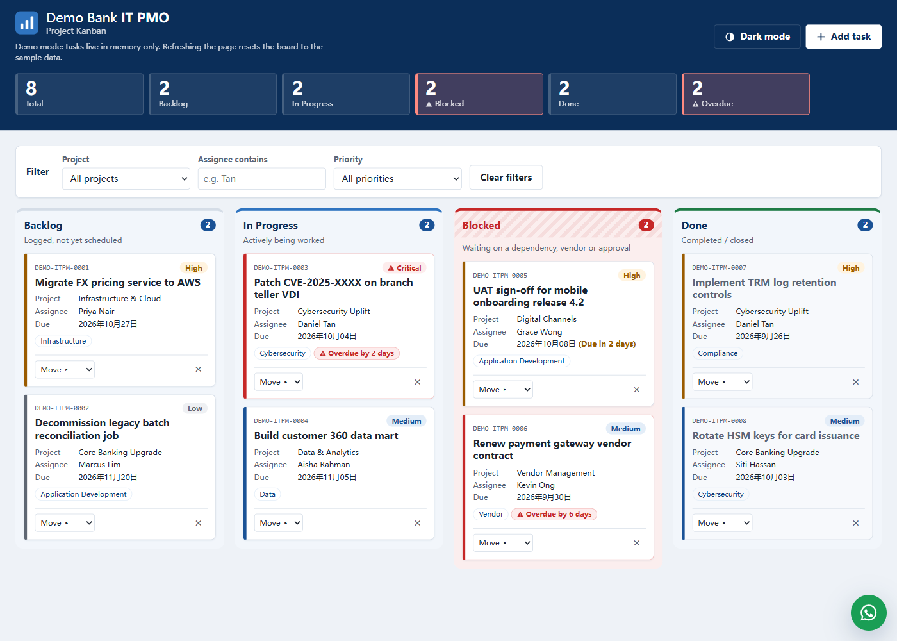
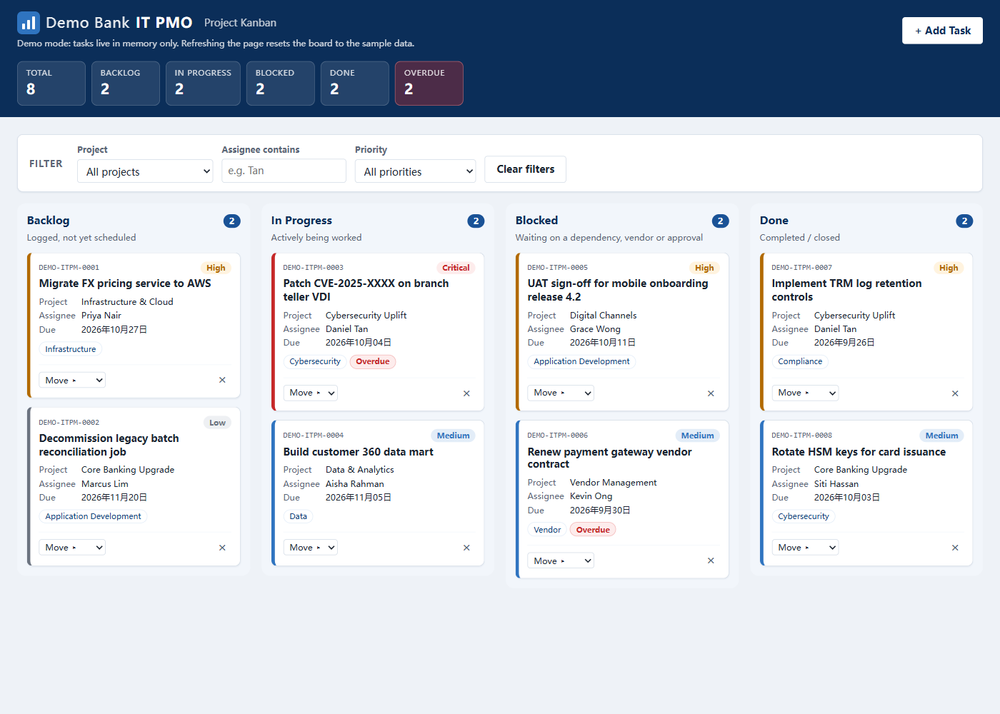

# kanban_test: Demo Bank IT PMO Kanban

A single-file IT PMO Kanban board for the fictitious **Demo Bank**, built as a demo and training tool. Each version of the app (markup, styles and script) lives in one HTML file written in vanilla HTML, CSS and JavaScript. There are no frameworks, build step or dependencies, and it runs straight from your file system.

**Live demos:**

- **v2 (redesign):** https://amy00436.github.io/kanban_test/v2/
- **v1 (original):** https://amy00436.github.io/kanban_test/



## What's new in v2

`v2/index.html` is a redesign of the same board. v1 at the site root is kept unchanged.

- **Flexbox layout.** The board shows four columns on wide screens, 2×2 on tablets and a single column on phones, with no horizontal scrolling. Touch targets are 44px on phones.
- **Dark mode toggle.** All colours are CSS custom properties on `:root`, and a dark set replaces them under `[data-theme="dark"]`. The board follows the OS setting until you press **Dark mode** in the header. The choice is held in memory only, like the tasks.
- **Urgency first.** The Blocked column has its own red, hatched header. Blocked and Overdue summary tiles are flagged when they're above zero. Overdue cards say how late they are ("Overdue by 2 days"), and tasks due within three days show "Due in N days".
- **Meeting announcement.** After the page has been visible for 10 seconds, a reminder card in the bottom-left corner announces the next IT Project Briefing (date, time and room) until you press **Got it**. It shows once per page load, is hidden again after the meeting date, and is never stored.
- **WhatsApp chat widget.** A floating button in the bottom-right corner opens an "IT PMO Assistant" panel with suggested questions built from the current board (overdue, blocked and critical counts, the busiest projects). Each one opens WhatsApp in a new tab with the question pre-filled. These are plain `wa.me` links, so no data is sent from the page itself.
- **Faster, tighter loading.** A Content Security Policy blocks every external request except FormSubmit. An inline SVG favicon removes the browser's extra `/favicon.ico` request, `color-scheme` stops dark mode flashing white on load, and typing in the assignee filter renders at most once per animation frame.

<details>
<summary>v1 screenshot</summary>



</details>

## Features

- **Four columns:** Backlog, In Progress, Blocked and Done, each with a task count.
- **Seed data:** eight sample IT PMO tasks (IDs `DEMO-ITPM-0001` onwards). Due dates are relative to today, so some tasks are always overdue.
- **Add tasks** through a modal form with validation (title, description, project/workstream, category, assignee, priority, due date, status).
- **Move tasks** by drag and drop between columns, or with the keyboard-accessible "Move ▸" menu on each card.
- **Delete tasks** with an inline Yes/No confirmation.
- **Filters** by project, assignee (text match) and priority, with a "Showing X of Y tasks" note and a Clear filters button.
- **Summary strip** in the header with totals per status and an overdue count, always covering all tasks, whatever the filters.
- **Overdue highlighting:** unfinished tasks past their due date get an "Overdue" badge.
- **Priority colour coding** (Critical, High, Medium, Low) on each card's edge and pill.
- **Email notification** for every new task via [FormSubmit](https://formsubmit.co/) (see below).
- Accessible and responsive: keyboard focus is kept across re-renders, toasts are announced to screen readers, and the columns stack on narrow screens.

## How to run

1. Download or clone this repository.
2. Double-click `v2/index.html` (or `index.html` for v1).

That's all. There's no build, no server and nothing to install.

> **No persistence, by design.** Tasks are held in memory only. Refreshing the page resets the board to the sample data. The app never uses localStorage, cookies or any other browser storage.

## Email notification setup (optional)

When a task is added, the app POSTs it to FormSubmit, which emails it to an address you choose. The card is added right away, and if the email fails you only get a warning toast.

1. In your **local copy** of `v2/index.html` (or `index.html`), find the first line of the script:
   ```js
   const FORMSUBMIT_ENDPOINT = "https://formsubmit.co/ajax/YOUR_EMAIL@example.com";
   ```
   Replace `YOUR_EMAIL@example.com` with your address.
2. Serve the folder over http, because FormSubmit always rejects pages opened via `file://`:
   ```sh
   python -m http.server
   ```
   Then open http://localhost:8000/v2/.
3. Add a task. The first submission to a new address triggers a **one-time activation email** from FormSubmit. Click its link, and later tasks will be delivered.

> **Do not commit a real email address.** Keep the `YOUR_EMAIL@example.com` placeholder in the repository. The CI check fails if any other address appears in either page.

## WhatsApp chat setup (v2, optional)

The chat widget links to `wa.me/<WHATSAPP_NUMBER>`, set near the top of the script in `v2/index.html`:

```js
const WHATSAPP_NUMBER = "6512345678";
```

The committed value is a placeholder. To try it with a real WhatsApp account, change it in your **local copy** only (digits only, country code first, no `+`). As with the email address, don't commit a real phone number.

## Project structure

```
index.html                    v1 app: markup, <style> and <script> (served at /)
v2/index.html                 v2 app: redesign with dark mode and chat widget (served at /v2/)
README.md                     This file
docs/screenshot-v2.png        v2 screenshot used in this README (not deployed)
docs/screenshot.png           v1 screenshot used in this README (not deployed)
.claude/skills/               Design, UX and security skills used to build v2
.claude/agents/               security-scanner agent (writes .docx reports to the git-ignored security-reports/)
.claude/scripts/              Stdlib-only Python script that builds the security report .docx
CLAUDE.md                     Constraints and architecture notes for contributors
.github/workflows/pages.yml   CI checks and GitHub Pages deployment
.gitignore
```

## CI/CD

`.github/workflows/pages.yml` runs on every push and pull request to `main`, and can be started by hand.

The **check** job runs against both `index.html` and `v2/index.html`, and fails the build if:

- a page uses a forbidden API or pattern: `localStorage`, `sessionStorage`, `indexedDB`, `document.cookie`, external `<script src>` or `<link>`, `!important`, `alert()` or `confirm()`;
- a page mentions a real bank's name;
- a page contains an email address other than `YOUR_EMAIL@example.com`;
- a page is missing or its HTML does not parse;
- [gitleaks](https://github.com/gitleaks/gitleaks) finds a secret anywhere in the git history.

The **deploy** job runs only after the checks pass, on pushes to `main` (and on manual runs). It publishes **only `index.html` and `v2/index.html`** to GitHub Pages, so nothing else in the repository is put on the site.

## Disclaimer

"Demo Bank" is a fictitious organisation created for demonstration and training. This project is not affiliated with, endorsed by or connected to any real bank or financial institution. All tasks, names and data are made up.
